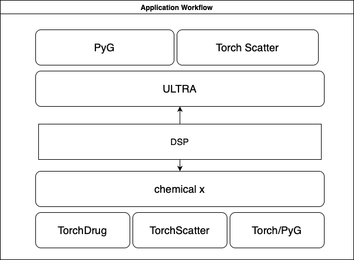
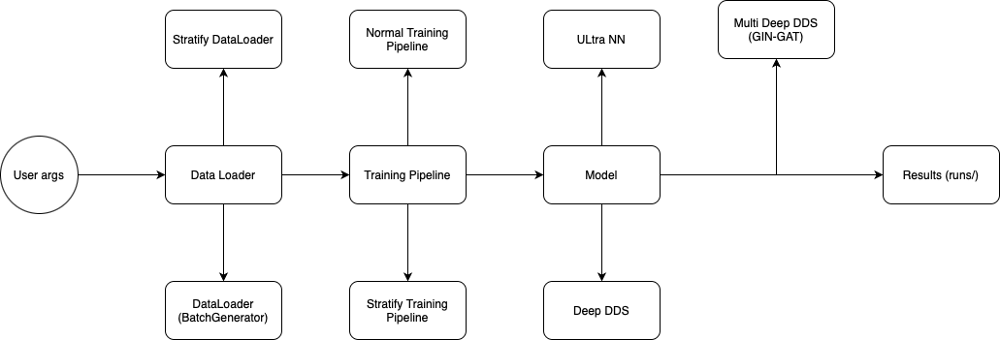

# DSP (Deep Synergy Prediction)


DSP (Deep Synergy Prediction) is a machine learning project designed to predict synergistic effects of Drugs using  Graph Representation learning models. The project includes training, evaluating, and saving the models, along with visualization of embeddings.

## Table of Contents

- [Installation](#installation)
- [Architecture](#architecture)
- [Usage](#usage)
  - [Training the Model](#training-the-model)
  - [Evaluating the Model](#evaluating-the-model)
  - [Visualizing Embeddings](#visualizing-embeddings)
- [Configuration](#configuration)
- [File Structure](#file-structure)
- [Demo](#demo)
- [Pending Tasks](#pending-tasks)
- [Cite This Work](#cite-this-work)


## Installation

1. Clone the repository:
   ```bash
   git clone https://github.com/sujaykumarmag/DSP.git
   cd DSP
   ```

2. Create and activate a virtual environment:
   ```bash
   python -m venv venv
   source venv/bin/activate  # On Windows, use `venv\Scriptsctivate`
   ```

3. Install the required packages:
   ```bash
   pip install -r requirements.txt
   ```


## Architecture


### Proposed Architecture



### Proposed Workflow



## Usage

### Training the Model

1. Configure the training parameters in `args.yaml` or via command-line arguments.

2. Run the training script:
   ```bash
   python3 train.py gin-gat drugcombdb --device=cpu --validation=True
   ```

### Evaluating the Model

The evaluation is integrated into the training script. After training, predictions and evaluation metrics are saved in the specified files.


### Visualizing Embeddings

Embeddings are visualized and saved during the training process. Ensure the visualization functions are properly implemented in your code.

## Configuration

Configuration parameters will be saved in `runs/args.yaml` for each experiment

### Example `args.yaml`
```yaml
batch_size: 32
dataset: drugcombdb
device: cpu
epochs: 1
learningrate: 0.01
model: gin-gat
results_dir: ./runs/
validation: false

```


## File Structure
```bash
root_directory/
├── src/
│   │
│   ├── dataloader.py
│   │
│   │
│   ├── utils.py
│   │
│   │
│   ├── model/
│   │   ├── deep_dds.py
│   │   ├── multi_deep_dds.py 
│   │   ├── ultra_nn.py 
│   │   ├── molecule.py (changes for finetunning the `ULTRA` model)
│   │   └── utils.py (changes for finetunning the `ULTRA` model)
│   │  
│   │
│   │
│   └── training/
│       ├── normal.py
│       └── stratify.py
│ 
│ 
│ 
├── runs/
│     ├── train 1
│     ├── train 2
│     ├── train 3
│     ├── train 4
│     ├── train 5
│     ├── train 6
│     ├── train 7
│     └── train 8
│           
│
│
│
├── train.py (Entry Point for the Program)
│
│
│ 
└── notebooks/
    └── train.ipynb ....
```


## Demo Video


## Pending Tasks

- [x] Optimize data loading and preprocessing
- [x] Implement additional visualization techniques
- [ ] Enhance documentation with more detailed explanations
- [ ] Add support for GPU training (MPS Not available in TorchDrug)
- [ ] Adding Graph Interpretability and Explainability using `Captum`


## Cite this

```bibtex
@misc{DSP2024,
  author = {SujayKumar Reddy M},
  title = {DSP (Deep Synergy Prediction)},
  year = {2024},
  publisher = {GitHub},
  journal = {GitHub Repository},
  howpublished = {\url{ https://github.com/sujaykumarmag/DSP.git}}
}
```


